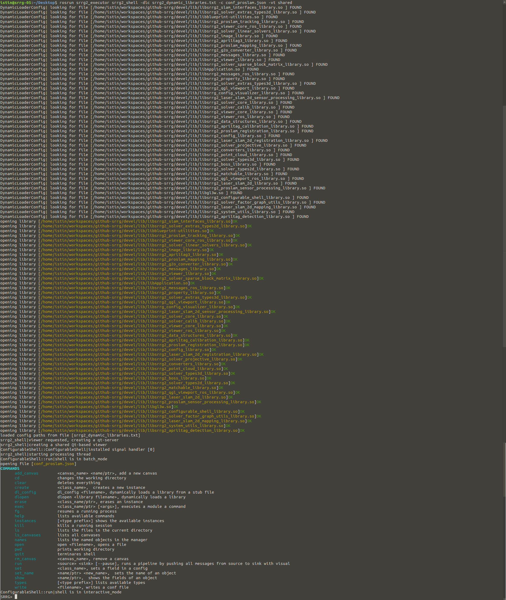
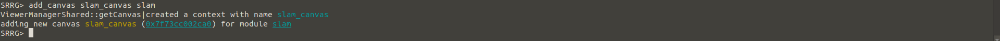

# Package `srrg2_executor`

Interactive shell to run and modify configurations on the fly. Viewer can be attached (both locally - in shared mode - and remotely - in ROS mode). Dependencies: [srrg2_core](https://github.com/srrg-sapienza/srrg2_core.git) and [srrg2_qgl_viewport](https://github.com/srrg-sapienza/srrg2_qgl_viewport.git). All the other package libraries are loaded dynamically.

## How to build
The `srrg2_executor` is developed using our `srrg2` framework.
All our software is tested both with Ubuntu 18.04 and 16.04 (GCC 5 and 7), still the remaining of this guide refers to Ubuntu 18.04.
Please follow this guide to build and run `srrg2_executor` on your machine:

1. initialize the `srrg2` Catkin workspace following the guide [here](https://github.com/srrg-sapienza/srrg2_core/tree/master/srrg2_core). As indicated in the aforementioned guide, we suggest to have a directory in which you clone all the `srrg2` repositories (referred here as `SRRG2_SOURCE_ROOT`) and a directory that contains the Catkin workspace (referred here as `SRRG2_WS_ROOT`)

2. clone all the `srrg2` dependencies of this package
```bash
cd <SRRG2_SOURCE_ROOT>
git clone https://github.com/srrg-sapienza/srrg2_cmake_modules.git # basic cmake-modules
git clone https://github.com/srrg-sapienza/srrg2_core.git # core data-structures and
git clone https://github.com/srrg-sapienza/srrg2_qgl_viewport.git # viewport
```

3. clone this repository
```bash
cd <SRRG2_SOURCE_ROOT>
git clone https://github.com/srrg-sapienza/srrg2_executor.git
```

4. link all the required packages in your Catkin workspace
```bash
cd <SRRG2_WS_ROOT>/src
ln -s <SRRG2_SOURCE_ROOT>/srrg2_cmake_modules .
ln -s <SRRG2_SOURCE_ROOT>/srrg_hbst/ .
ln -s <SRRG2_SOURCE_ROOT>/srrg2_core/srrg2_core .
ln -s <SRRG2_SOURCE_ROOT>/srrg2_core/srrg2_core_ros .
ln -s <SRRG2_SOURCE_ROOT>/srrg2_qgl_viewport/srrg2_qgl_viewport .
ln -s <SRRG2_SOURCE_ROOT>/srrg2_qgl_viewport/srrg2_qgl_viewport_ros .
ln -s <SRRG2_SOURCE_ROOT>/srrg2_executor/srrg2_executor .
```

5. build using Catkin
```bash
cd <SRRG2_WS_ROOT>
catkin build
```

6. [OPTIONAL] build unit-tests using catkin
```bash
cd <SRRG2_WS_ROOT>
catkin build --catkin-make-args tests
```

## How to run
This package offers 2 executable: `auto_dl_finder` and `srrg2_shell`. The former reads the catkin `devel` dir created after the build step and generates a file with all the `srrg2` dynamic libraries. This is then passed as **mandatory** argument to `srrg2_shell`, to load at runtimes all the libraries required to run a specific pipelines.
Through `srrg2_shell` you can either load, modify and run your configuration - using the option `-c` - or generate one on the fly and then run it. For more details run:
```sh
source <SRRG2_WS_ROOT>/devel/setup.bash
rosrun srrg2_executor srrg2_shell -h
```

Warning: to execute the shell you to have the `roscore` active in your system.

###### Example: how to run a pipeline configuration from `srrg2_executor`
In this case, we assume to have a pipeline configuration - e.g. [srrg2_proslam](https://github.com/srrg-sapienza/srrg2_proslam.git) - named `config_proslam.json`.

1. Run the `auto_dl_finder` and collect all `srrg2` dynamic libraries into a file. If you already have this file, this step might not be necessary.
```bash
source <SRRG2_WS_ROOT>/devel/setup.bash
rosrun srrg2_executor auto_dl_finder -dlc srrg2_dynamic_libraries.txt # srrg2_dynamic_libraries.txt is the output file
```


1. Run the `srrg2_shell` application
```bash
rosrun srrg2_executor srrg2_shell -c <path>/<to>/<a>/<configuration>/<file> -vt shared
```




2. List all the modules instances in your configuration
```bash
SRRG$ instances
```


3. Attach a viewport to the `GraphSLAM` module
```bash
SRRG$ add_canvas slam_canvas slam
```



4. Run the pipelines
```bash
SRRG$ run sync slam
```

To pause the running hit `CTRL + C`; to resume the processing type `fg`; to process step-by-step `CTRL + J`.
